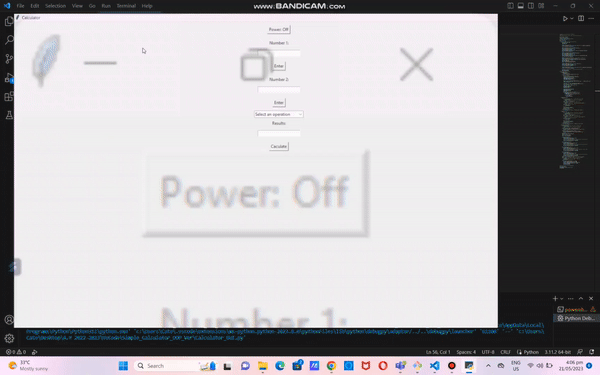

# Simple_Calculator_OOP_Ver
This program portrays the following features:
1. Asks the user to choose one of the four math operations (Addition, Subtraction, Multiplication and Division)

2. Asks the user for two numbers

3. Displays the result

4. Ask if the user wants to try again or not.

5. If yes, repeat Step 1.

6. If no, Display “Thank you!” and the program will exit 

7. Uses Python Function and appropriate Exceptions to capture errors during runtime.

8. Rewritten in an Object Oriented Program Manner

# Demo

# Needed Module
Tkinter

The tkinter package (“Tk interface”) is the standard Python interface to the Tcl/Tk GUI toolkit. Both Tk and tkinter are available on most Unix platforms, including macOS, as well as on Windows systems. Tkinter is the standard GUI library for Python. Tkinter provides a powerful object-oriented interface to the Tk GUI toolkit. 

# Tkinter Features
Tkinter offers the following features:

-Displaying Text and Images With Label Widgets

-Displaying Clickable Buttons With Button Widgets

-Getting User Input With Entry Widgets

-Getting Multiline User Input With Text Widgets

-Assigning Widgets to Frames With Frame Widgets

-Adjusting Frame Appearance With Reliefs

-Understanding Widget Naming Conventions

-Check Your Understanding

-Controlling Layout With Geometry Managers

-Making Your Applications Interactive

# Installation
If you are using Python version 3.x, then tkinter is included in the standard Python library, so there is no need to download it separately. It should already be available as long as you have the current version of Python installed on your computer.
